# DHIS-to-RapidPro


## Table of Contents

1. [Introduction](#introduction)
2. [Requirements](#requirements)
3. [Getting Started](#getting-started)
4. [Features](#features)
    1. [Contact Synchronisation](#contact-synchronisation)
    2. [Aggregate Report Transfer](#aggregate-report-transfer)
        1. [DHIS2 Instructions](#dhis2-instructions)
        2. [RapidPro Instructions](#rapidpro-instructions)
           1. [Polling](#polling)
           2. [Webhook](#webhook)
    3. [Auto-Reminders](#auto-reminders)
5. [Configuration](#configuration)
6. [Management & Monitoring](#management--monitoring)
7. [Recovering Failed Reports](#recovering-failed-reports)
8. [Extending DHIS-to-RapidPro](#extending-dhis-to-rapidpro)
9. [Troubleshooting Guide](#troubleshooting-guide)
10. [Acknowledgments](#acknowledgments)

## Introduction

DHIS-to-RapidPro is a stand-alone Java solution that integrates DHIS2 with RapidPro. [DHIS2](https://dhis2.org/about/) is an open-source information system primarily used in the health domain while [RapidPro](https://rapidpro.github.io/rapidpro/) is an open-source workflow engine for running mobile-based services.

DHIS-to-RapidPro provides:

* Routine synchronisation of RapidPro contacts with DHIS2 users
* Aggregate report transfer from RapidPro to DHIS2 via polling or webhook messaging
* Automated reminders to RapidPro contacts when their aggregate reports are overdue

## Requirements

* Java 11
* RapidPro v7.4
* DHIS >= v2.36

## Getting Started

### Shell

The JAR distribution of DHIS-to-RapidPro allows you to run it a stand-alone program. On *nix operating systems, you can execute DHIS-to-RapidPro from your terminal like so:

```shell
./dhis2rapidpro.jar
```

The above command will give an error since no parameters are provided. The next commands are common DHIS-to-RapidPro *nix usage examples:

##### Basic usage
```shell
./dhis2rapidpro.jar --dhis2.api.url=https://play.dhis2.org/2.38.1/api \
--dhis2.api.pat=d2pat_apheulkR1x7ac8vr9vcxrFkXlgeRiFc94200032556 \
--rapidpro.api.url=https://rapidpro.dhis2.org/api/v2 \
--rapidpro.api.token=3048a3b9a04c1948aa5a7fd06e7592ba5a17d3d0
```

##### Auto-reminders
```shell
./dhis2rapidpro.jar --dhis2.api.url=https://play.dhis2.org/2.38.1/api \
--dhis2.api.pat=d2pat_apheulkR1x7ac8vr9vcxrFkXlgeRiFc94200032556 \
--rapidpro.api.url=https://rapidpro.dhis2.org/api/v2 \
--rapidpro.api.token=3048a3b9a04c1948aa5a7fd06e7592ba5a17d3d0 \
--reminder.data.set.codes=DS_359414,DS_543073,HIV_CARE
```

##### Contact synchronisation disabled
```shell
./dhis2rapidpro.jar --dhis2.api.url=https://play.dhis2.org/2.38.1/api \
--dhis2.api.pat=d2pat_apheulkR1x7ac8vr9vcxrFkXlgeRiFc94200032556 \
--sync.rapidpro.contacts=false
```

##### Report polling
```shell
./dhis2rapidpro.jar --dhis2.api.url=https://play.dhis2.org/2.38.1/api \
--dhis2.api.pat=d2pat_apheulkR1x7ac8vr9vcxrFkXlgeRiFc94200032556 \
--rapidpro.api.url=https://rapidpro.dhis2.org/api/v2 \
--rapidpro.api.token=3048a3b9a04c1948aa5a7fd06e7592ba5a17d3d0 \
--rapidpro.flow.uuids=21a055c2-f0a7-4ec3-9e5e-bc05504b8967,1baa7dd3-9ccf-4ee8-b7a4-8779ba22b933,a6fd08af-4757-46a0-b4a7-c9a210b425db
```

To execute DHIS-to-RapidPro from Windows, enter the following terminal command:

```shell
java -jar dhis2-to-rapidpro.jar
```

The above command will give an error since no parameters are provided. The next commands are common DHIS-to-RapidPro Windows usage examples:

##### Basic usage
```shell
java -jar dhis2rapidpro.jar \
--dhis2.api.url=https://play.dhis2.org/2.38.1/api \
--dhis2.api.pat=d2pat_apheulkR1x7ac8vr9vcxrFkXlgeRiFc94200032556 \
--rapidpro.api.url=https://rapidpro.dhis2.org/api/v2 \
--rapidpro.api.token=3048a3b9a04c1948aa5a7fd06e7592ba5a17d3d0
```

##### Auto-reminders
```shell
java -jar dhis2rapidpro.jar \ 
--dhis2.api.url=https://play.dhis2.org/2.38.1/api \
--dhis2.api.pat=d2pat_apheulkR1x7ac8vr9vcxrFkXlgeRiFc94200032556 \
--rapidpro.api.url=https://rapidpro.dhis2.org/api/v2 \
--rapidpro.api.token=3048a3b9a04c1948aa5a7fd06e7592ba5a17d3d0 \
--reminder.data.set.codes=DS_359414,DS_543073,HIV_CARE
```

##### Contact synchronisation disabled
```shell
java -jar dhis2rapidpro.jar \
--dhis2.api.url=https://play.dhis2.org/2.38.1/api \
--dhis2.api.pat=d2pat_apheulkR1x7ac8vr9vcxrFkXlgeRiFc94200032556 \
--sync.rapidpro.contacts=false
```

##### Report polling
```shell
java -jar dhis2rapidpro.jar \
--dhis2.api.url=https://play.dhis2.org/2.38.1/api \
--dhis2.api.pat=d2pat_apheulkR1x7ac8vr9vcxrFkXlgeRiFc94200032556 \
--rapidpro.api.url=https://rapidpro.dhis2.org/api/v2 \
--rapidpro.api.token=3048a3b9a04c1948aa5a7fd06e7592ba5a17d3d0 \
--rapidpro.flow.uuids=21a055c2-f0a7-4ec3-9e5e-bc05504b8967,1baa7dd3-9ccf-4ee8-b7a4-8779ba22b933,a6fd08af-4757-46a0-b4a7-c9a210b425db
```

### WAR

To run DHIS-to-RapidPro as a web application inside a web container like Tomcat, download the WAR distribution and drop it in the web container's applications directory. Configuration properties for WAR deployment can be expressed as:

1. OS environments variables
2. Key/value pairs in a file named `application.properties`. Create a directory called `config` within the web container's working directory and place `application.properties` in this new directory.
3. YAML in a file named `application.yml`. Create a directory called `config` within the web container's working directory and place `application.yml` in this new directory.

## Features

### Contact Synchronisation

When contact synchronisation is triggered, DHIS-to-RapidPro fetches the users from your DHIS2 server to either:
* create RapidPro contacts containing the DHIS2 user's ID, organisation unit ID, name, and mobile phone number, or
* update existing RapidPro contacts to match any changes in the corresponding DHIS2 users.

Prior to synchronisation, DHIS-to-RapidPro automatically creates in RapidPro:
* the contact group `DHIS2`, and 
* two contact fields named `dhis2_organisation_unit_id` and `dhis2_user_id`

DHIS-to-RapidPro will re-create this group and these fields should they be deleted. During synchronisation, each contact is assigned to the `DHIS2` group and has its fields populated accordingly. Application errors during the syncing of a contact will lead to warnings in the log but the error will not abort the synchronisation process. In other words, synchronisation may be partially successful.

Contact synchronisation is enabled by default. Setting `sync.rapidpro.contacts` to `false` disables synchronisation. The interval rate at which contacts are synchronised is expressed as a cron expression with the config key `sync.schedule.expression`. Alternatively, hit DHIS-to-RapidPro's URL path `/dhis2rapidpro/sync`to manually kickoff syncing.

### Aggregate Report Transfer

Follow the subsequent DHIS2 and RapidPro setup instructions to be able to transfer aggregate reports from RapidPro to DHIS2.

#### DHIS2 Instructions

1. Configure codes for the data sets that the reports transmitted from RapidPro to DHIS-to-RapidPro will target. To configure the data set code:
    1. Go to the maintenance app
    2. Open the data sets page
    3. Search for the data set
    4. Enter a suitable code in the _Code_ field as shown next:
       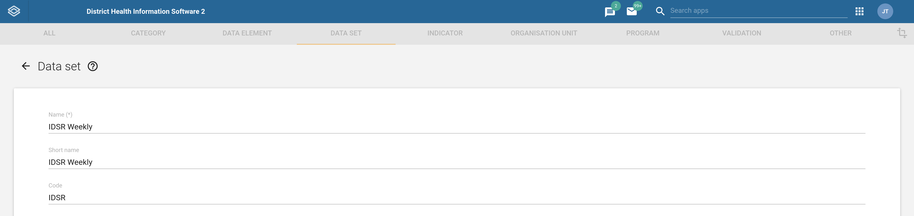
       >**IMPORTANT:** you need to enter a code that starts with a letter, a hyphen, an underscore, or a whitespace to achieve successful interoperability between DHIS2 and RapidPro.

2. Configure a code in each data element that will capture an aggregate value from RapidPro. To configure the data element code:
   1. Go to the maintenance app
   2. Open the data elements page
   3. Search for the data element
   4. Enter a suitable code in the _Code_ field as shown next:
      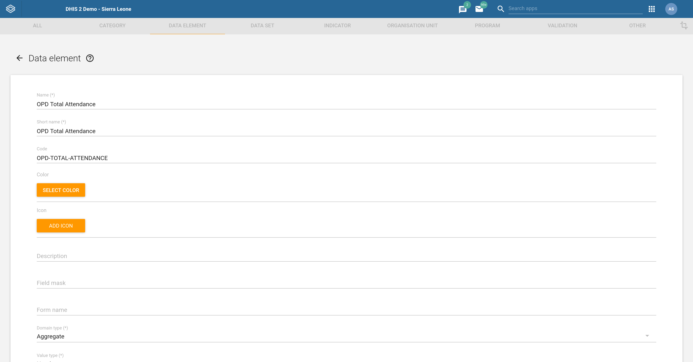
      >**IMPORTANT:** you need to enter a code that starts with a letter, a hyphen, an underscore, or a whitespace to achieve successful interoperability between DHIS2 and RapidPro.

3. Configure a code in each category option combination that will be used to dissagregate captured values. To configure the category option combination code:
    1. Go to the maintenance app
    2. Open the category option combination page
    3. Search for the category option combination
    4. Enter a suitable code in the _Code_ field as shown next:
       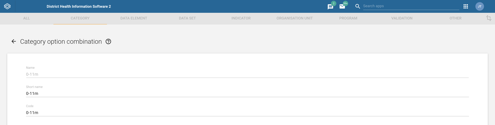
       >**IMPORTANT:** you need to enter a code that starts with a letter, a hyphen, an underscore, or a whitespace to achieve successful interoperability between DHIS2 and RapidPro.
      
#### RapidPro Instructions

DHIS-to-RapidPro can ingest aggregate reports from RapidPro as:
* Completed flow executions that are retrieved while polling the RapidPro API, or
* RapidPro webhook messages 

Each ingestion mode comes with its own set of trade-offs. For instance, webhook messaging scales better than polling but reports can be lost due to consecutive network failures. In contrast, having DHIS-to-RapidPro routinely scan flow executions leads to more load on the RapidPro server, however, polling is more reliable than webhook messaging since network failures during polling will only _interrupt_ DHIS-to-RapidPro from ingesting the report rather than losing the report itself. Generally speaking, report polling is recommended over webhook messaging but your requirements will dictate which ingestion mode to employ. The next sections describe the configuration steps for the respective ingestion modes.

##### Polling

1. Open a RapidPro flow definition that processes the contact's report or create a new flow definition.

2. Identify the root of each happy flow path, that is, the root of each successful execution path. You should apply the proceeding steps to these root paths. 

3. Save a result containing the DHIS code of the data set representing the report:
 
    

   Type the result name `data_set_code` and give it as a value the code of the data set as retrieved from DHIS2's maintenance app.

4. Save each incoming report value to a result as per the example shown next:

    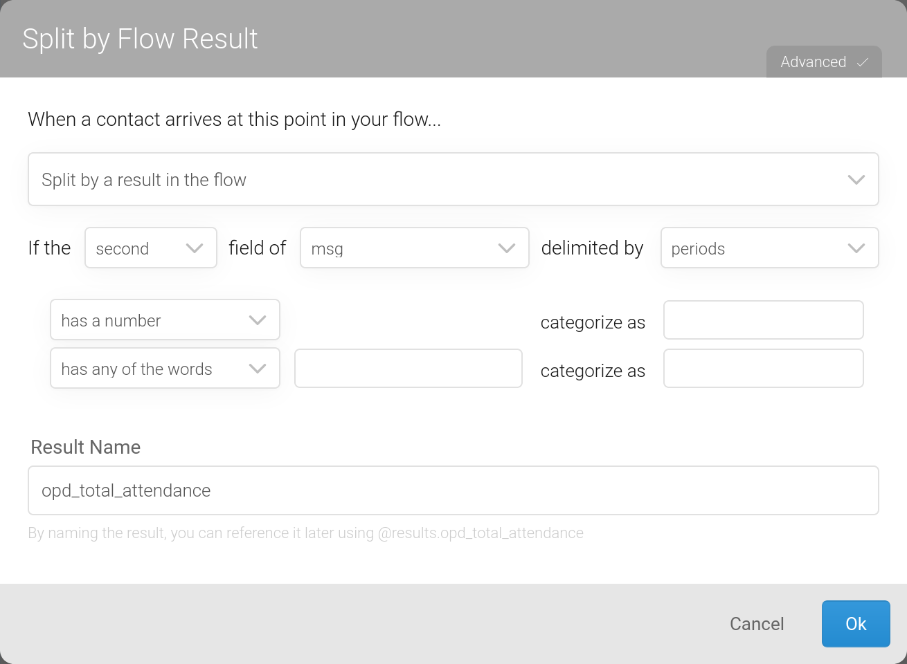

   The result name must match the code of the corresponding data element in DHIS2. Upper case letters in the data element code can be entered as lower case letters in the result name field while whitespaces and hyphens can be entered as underscores If a category option combination is required, suffix the result name with two underscores and append the category option combination code to the suffix:

    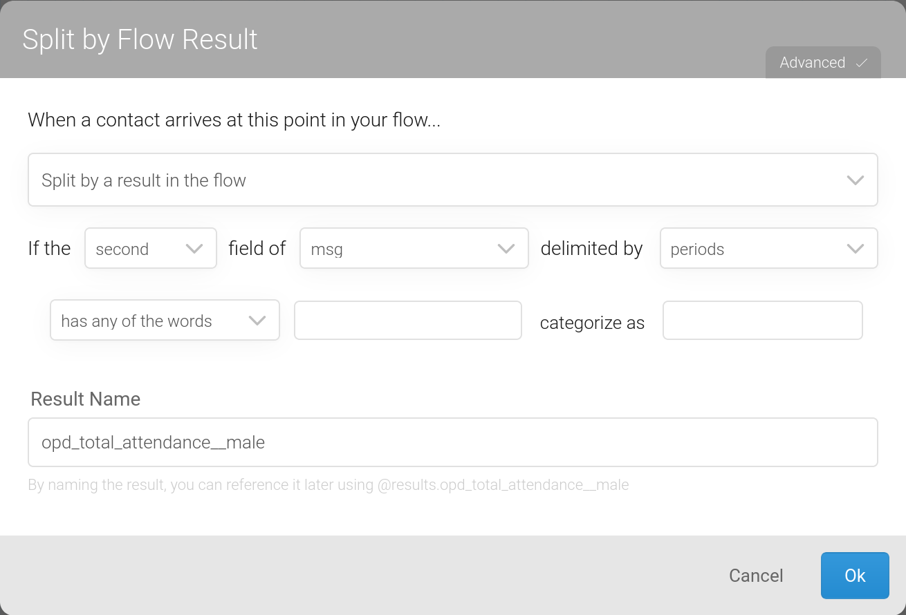

5. Optionally, save a result which contains the report period offset:

    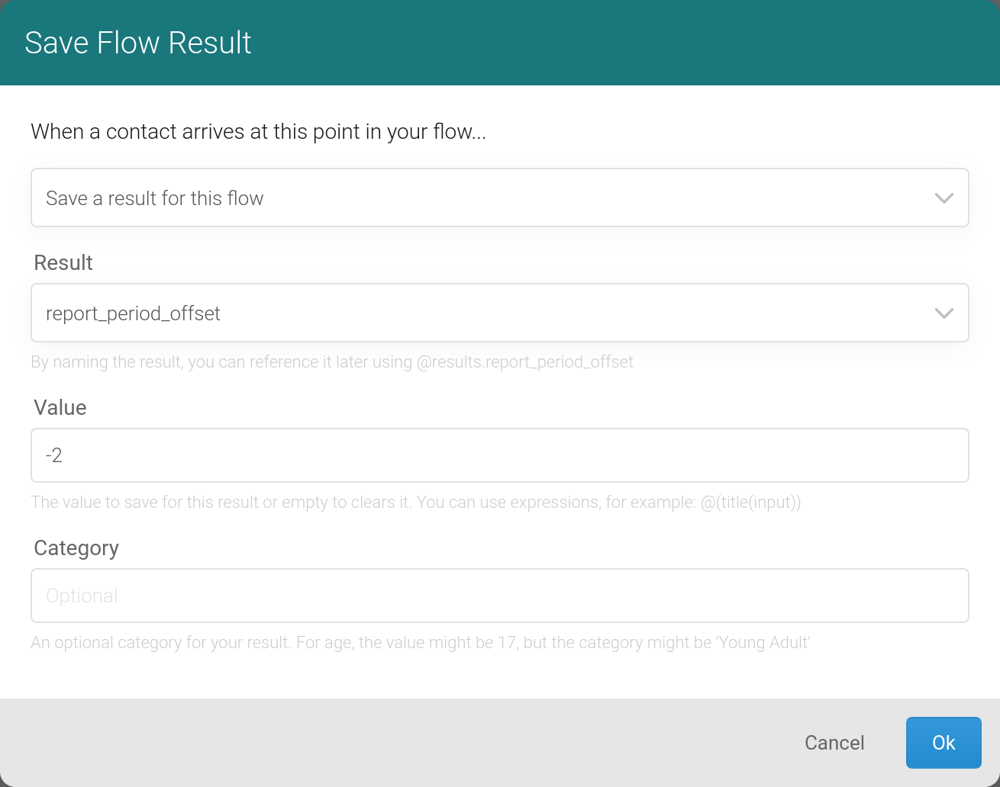

    Type the result name `report_period_offset` and give it as a value the relative period to add or subtract from the current reporting period sent to DHIS2. If omitted, the report period offset defaults to -1.

6. If contact synchronisation is disabled (see `sync.rapidpro.contacts` in [Configuration](#configuration)), then create a custom contact field named _DHIS2 Organisation Unit ID_:

    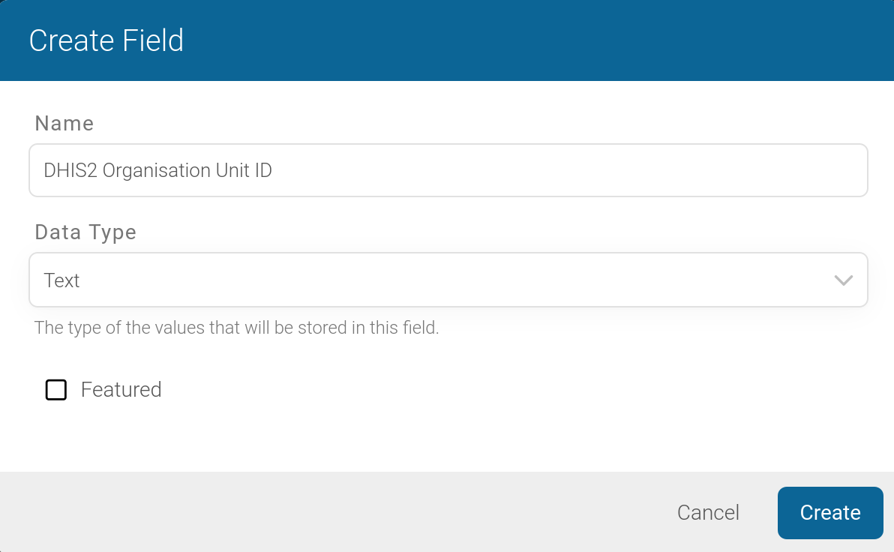

    You must populate this field, either manually or automatically, for each contact belonging to a DHIS2 organisation unit. The field should hold the contact's DHIS2 organisation unit identifier. By default, DHIS-to-RapidPro expects the organisation unit identifier to be the ID (see `org.unit.id.scheme` in [Configuration](#configuration)).

7. Copy the UUID of the flow definition from your browser's address bar:
   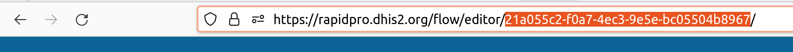

8. Paste the copied flow definition UUID into DHIS-to-RapidPro's `rapidpro.flow.uuids` config property:

    ```shell
    java -jar dhis2rapidpro.jar \ 
   --dhis2.api.url=https://play.dhis2.org/2.38.1/api \ 
   --dhis2.api.pat=d2pat_apheulkR1x7ac8vr9vcxrFkXlgeRiFc94200032556 \
   --rapidpro.api.url=https://rapidpro.dhis2.org/api/v2 \
   --rapidpro.api.token=3048a3b9a04c1948aa5a7fd06e7592ba5a17d3d0 \
   --rapidpro.flow.uuids=21a055c2-f0a7-4ec3-9e5e-bc05504b8967
    ```
    
    You can poll multiple flows by having the flow UUIDs comma separated:

   ```shell
    java -jar dhis2rapidpro.jar \ 
   --dhis2.api.url=https://play.dhis2.org/2.38.1/api \ 
   --dhis2.api.pat=d2pat_apheulkR1x7ac8vr9vcxrFkXlgeRiFc94200032556 \
   --rapidpro.api.url=https://rapidpro.dhis2.org/api/v2 \
   --rapidpro.api.token=3048a3b9a04c1948aa5a7fd06e7592ba5a17d3d0 \
   --rapidpro.flow.uuids=21a055c2-f0a7-4ec3-9e5e-bc05504b8967,1baa7dd3-9ccf-4ee8-b7a4-8779ba22b933,a6fd08af-4757-46a0-b4a7-c9a210b425db
    ```

    >NOTE: `scan.reports.schedule.expression` config property determines how often flow executions are polled. Consult the [configuration](#configuration) section for further information.

##### Webhook

1. Open a RapidPro flow definition that processes the contact's report or create a new flow definition.

2. Identify the root of each happy flow path, that is, the root of each successful execution path. You should apply the proceeding steps to these root paths.

3. Save each incoming aggregate value in the RapidPro flow to a result like what is shown next:

    

    The result name must match the code of the corresponding data element in DHIS2. Upper case letters in the data element code can be entered as lower case letters in the result name field while whitespaces and hyphens can be entered as underscores. If a category option combination is required, suffix the result name with two underscores and append the category option combination code to the suffix:

    

4. Create a webhook call node in the RapidPro flow to dispatch the results to DHIS-to-RapidPro:

    

   The webhook call node must be configured as follows:
   - Select the HTTP method to be `POST`:
   
     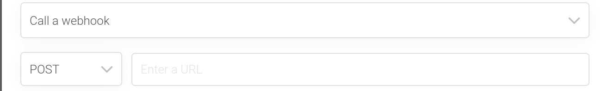
   
   - Set the URL field to the HTTP(S) address that DHIS-to-RapidPro is listening on. The default HTTPS port number is _8443_ (see `server.port` in [Configuration](#configuration)): the path in the URL field is required to end with `/dhis2rapidpro/webhook`:
     
   - Append to the URL the `dataSetCode` query parameter which identifies by code the data set that the contact is reporting. You need to look up the data set from the DHIS2 maintenance app and hard-code its code as shown below:
     
   - You can optionally append the `reportPeriodOffset` query parameter which is the relative period to add or subtract from the current reporting period sent to DHIS2. If omitted, the `reportPeriodOffset` parameter defaults to -1.
     
   - Another optional query parameter you can append is `orgUnitId`. This parameter overrides the value set in the contact's _DHIS2 Organisation Unit ID_ field.
   - If you have set the config property `webhook.security.auth` in DHIS-to-RapidPro to `token` in order to protect the webhook endpoint from unauthorised access, switch to the _HTTP Headers_ tab and enter a new header named `Authorization` having as value the authentication scheme `Token` alongside the token generated at startup from DHIS-to-RapidPro:

     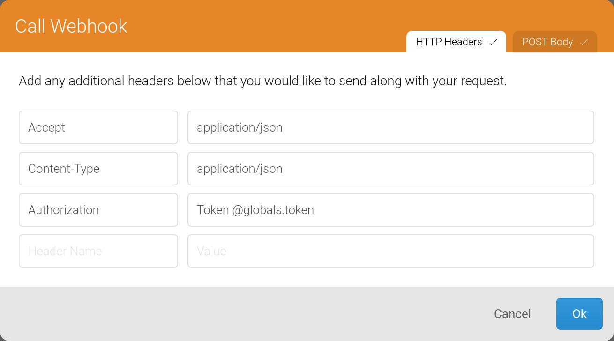
    
     >***SECURITY***: inside the _Authorization_ header value text field, you should reference a global holding the secret token instead of directly entering the token so that the token is not accidentally compromised when exporting the flow definition.

5. If contact synchronisation is disabled (see `sync.rapidpro.contacts` in [Configuration](#configuration)), then create a custom contact field named _DHIS2 Organisation Unit ID_:

    

    Unless the `orgUnitId` webhook query parameter is set, you must populate this field, either manually or automatically, for each contact belonging to a DHIS2 organisation unit. The field should hold the contact's DHIS2 organisation unit identifier. By default, DHIS-to-RapidPro expects the organisation unit identifier to be the ID (see `org.unit.id.scheme` in [Configuration](#configuration)).

### Auto-Reminders

Reminders for overdue reports are sent for each DHIS2 data set specified in the config property `reminder.data.set.codes`. In this property, you enter the data set codes separated by comma. Reminders are sent to contacts that are within the `DHIS2` group. This group is automatically created and contacts assigned to it as part of the contact synchronisation process but you can also manually create the group in RapidPro as shown below:

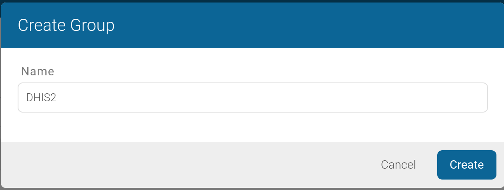

>CAUTION: do not forget to assign auto-reminder contacts to the `DHIS2` group

The interval rate at which contacts are reminded is expressed as a cron expression with the config key `reminder.schedule.expression`. Alternatively, hit DHIS-to-RapidPro's URL path `/dhis2rapidpro/reminders`to broadcast the reminders for overdue reports.

## Configuration

By order of precedence, a config property can be specified:

1. as a command-line argument (e.g., `--dhis2.api.url=https://play.dhis2.org/2.38.1/api`)
2. as an OS environment variable (e.g., `export DHIS2_API_URL=https://play.dhis2.org/2.38.1/api`)
3. in a key/value property file called `application.properties` or a YAML file named `application.yml`

| Config name                           | Description                                                                                                                                                                                                                                                                                             | Default value                                                                  | Example value                                                                                                                        |
|---------------------------------------|---------------------------------------------------------------------------------------------------------------------------------------------------------------------------------------------------------------------------------------------------------------------------------------------------------|--------------------------------------------------------------------------------|--------------------------------------------------------------------------------------------------------------------------------------|
| `dhis2.api.url`                       | DHIS2 server Web API URL.                                                                                                                                                                                                                                                                               |                                                                                | `https://play.dhis2.org/2.38.1/api`                                                                                                  |
| `dhis2.api.pat`                       | Personal access token to authenticate with on DHIS2. This property is mutually exclusive to `dhis2.api.username` and `dhis2.api.password`.                                                                                                                                                              |                                                                                | `d2pat_apheulkR1x7ac8vr9vcxrFkXlgeRiFc94200032556`                                                                                   |
| `dhis2.api.username`                  | Username of the DHIS2 user to operate as.                                                                                                                                                                                                                                                               |                                                                                | `admin`                                                                                                                              |
| `dhis2.api.password`                  | Password of the DHIS2 user to operate as.                                                                                                                                                                                                                                                               |                                                                                |                                                                                                                                      |
| `rapidpro.api.url`                    | RapidPro server Web API URL.                                                                                                                                                                                                                                                                            |                                                                                | `https://rapidpro.dhis2.org/api/v2`                                                                                                  |
| `rapidpro.api.token`                  | API token to authenticate with on RapidPro.                                                                                                                                                                                                                                                             |                                                                                | `3048a3b9a04c1948aa5a7fd06e7592ba5a17d3d0`                                                                                           |
| `server.port`                         | The TCP port number the application will bind to for accepting HTTP requests.                                                                                                                                                                                                                           | `8443`                                                                         | `443`                                                                                                                                |
| `sync.schedule.expression`            | Cron expression for synchronising RapidPro contacts with DHIS2 users. By default, synchronisation occurs every half hour.                                                                                                                                                                               | `0 0/30 * * * ?`                                                               | `0 0 0 * * ?`                                                                                                                        |
| `reminder.schedule.expression`        | Cron expression for broadcasting reminders of overdue reports to RapidPro contacts. By default, overdue report reminders are sent at 9 a.m. every day.                                                                                                                                                  | `0 0 9 ? * *`                                                                  | `0 0 0 * * ?`                                                                                                                        |
| `sync.rapidpro.contacts`              | Whether to routinely create and update RapidPro contacts from DHIS2 users.                                                                                                                                                                                                                              | `true`                                                                         | `false`                                                                                                                              |
| `reminder.data.set.codes`             | Comma-delimited list of DHIS2 data set codes for which overdue report reminders are sent.                                                                                                                                                                                                               |                                                                                | `DS_359414,HIV_CARE`                                                                                                                 |
| `rapidpro.flow.uuids`                 | Comma-delimited list of RapidPro flow definition UUIDs to scan for completed flow executions.                                                                                                                                                                                                           |                                                                                | `DS_359414,HIV_CARE`                                                                                                                 |
| `scan.reports.schedule.expression`    | Cron expression specifying how often RapidPro is queried for flow executions. By default, RapidPro is queried every thirty minutes.                                                                                                                                                                     | `0 0/30 * * * ?`                                                               | `0 0 0 * * ?`                                                                                                                        |
| `report.delivery.schedule.expression` | Cron expression specifying when queued reports are delivered to DHIS2.                                                                                                                                                                                                                                  |                                                                                | `0 0 0 * * ?`                                                                                                                        |
| `org.unit.id.scheme`                  | By which field organisation units are identified.                                                                                                                                                                                                                                                       | `ID`                                                                           | `CODE`                                                                                                                               |
| `webhook.security.auth`               | Authentication scheme protecting the webhook HTTP(S) endpoint. Supported values are `none` and `token`.                                                                                                                                                                                                 | `none`                                                                         | `token`                                                                                                                              |
| `spring.security.user.name`           | Login username for non-webhook services like the Hawtio and H2 web consoles.                                                                                                                                                                                                                            | `dhis2rapidpro`                                                                | `admin`                                                                                                                              |
| `spring.security.user.password`       | Login password for non-webhook services like the Hawtio and H2 web consoles.                                                                                                                                                                                                                            | `dhis2rapidpro`                                                                | `secret`                                                                                                                             |
| `spring.h2.console.enabled`           | Whether to enable the H2 web console.                                                                                                                                                                                                                                                                   | `true`                                                                         | `false`                                                                                                                              |
| `spring.datasource.url`               | JDBC URL for persisting undeliverable reports and JMS queues.                                                                                                                                                                                                                                           | `jdbc:h2:./dhis2rapidpro;AUTO_SERVER=TRUE`                                     | `jdbc:postgresql://localhost:5432/dhis2rapidpro`                                                                                     |
| `spring.datasource.username`          | Username to access the JDBC data source.                                                                                                                                                                                                                                                                | `dhis2rapidpro`                                                                | `admin`                                                                                                                              |
| `spring.datasource.password`          | Password to access the JDBC data source.                                                                                                                                                                                                                                                                | `dhis2rapidpro`                                                                | `secret`                                                                                                                             |
| `spring.datasource.driver-class-name` | Class name of the JDBC driver used to connect to the database. Changing this property requires that you add the database vendor's JDBC driver to the Java classpath.                                                                                                                                    | `org.h2.Driver`                                                                | `org.postgresql.Driver`                                                                                                              |
| `spring.jmx.enabled`                  | Whether to expose the JMX metrics.                                                                                                                                                                                                                                                                      | `true`                                                                         | `false`                                                                                                                              |


##  Management & Monitoring

DHIS-to-RapidPro exposes its metrics through JMX. A JMX client like [VisualVM](https://visualvm.github.io/) can be used to observe these metrics, however, DHIS-to-RapidPro comes bundled with [Hawtio](https://hawt.io/) so that the system operator can easily monitor and manage runtime operations of the application without prior setup

From the Hawtio web console, apart from browsing application logs, the system operator can manage queues and endpoints, observe the application health status and queued RapidPro webhook messages, collect CPU and memory diagnostics, as well as view application settings:

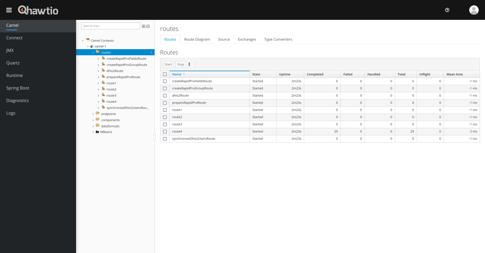

You can log into the Hawtio console locally from [https://localhost:8443/management/hawtio](https://localhost:8443/management/hawtio) using the username and password `dhis2rapidpro`. You can set the parameter `management.endpoints.web.exposure.include` (i.e., `--management.endpoints.web.exposure.include=`) to an empty value to deny HTTP access to the Hawtio web console.

>***SECURITY***: immediately change the login credentials during setup (see `spring.security.user.name` and `spring.security.user.password` in [Configuration](#configuration)).

## Recovering Failed Reports

A report that fails to be delivered to DHIS2, perhaps because of an invalid webhook payload or an HTTP timeout error, has its associated RapidPro webhook JSON payload pushed to a relational dead letter channel for manual inspection. The dead letter channel table schema is as follows:

| Column name          | Column type              | Description                                                                                                                                                                                                                                                                                                                          | Column value example                                                                                                                                                                                                                                                                                                                                 |
|----------------------|--------------------------|--------------------------------------------------------------------------------------------------------------------------------------------------------------------------------------------------------------------------------------------------------------------------------------------------------------------------------------|------------------------------------------------------------------------------------------------------------------------------------------------------------------------------------------------------------------------------------------------------------------------------------------------------------------------------------------------------|
| ID                   | INTEGER                  | An auto-increment number identifying the row uniquely.                                                                                                                                                                                                                                                                               | 6                                                                                                                                                                                                                                                                                                                                                    |
| PAYLOAD              | VARCHAR                  | Webhook JSON message as sent by RapidPro.                                                                                                                                                                                                                                                                                            | `{"contact":{"name":"John Doe","urn":"tel:+12065551213","uuid":"fb3787ab-2eda-48a0-a2bc-e2ddadec1286"},"flow":{"name":"APT","uuid":"cb0360e3-d82a-4521-aad3-15afd704ec26"},"results":{"msg":{"value":"APT.2.4.6"},"gen_ext_fund":{"value":"2"},"mal_pop_total":{"value":"10"},"mal_llin_distr_pw":{"value":"3"},"gen_domestic_fund":{"value":"5"}}}` |
| DATA_SET_CODE        | VARCHAR                  | Code of the DHIS2 data set that the report belongs to.                                                                                                                                                                                                                                                                               | `HIV_CARE`                                                                                                                                                                                                                                                                                                                                           |
| REPORT_PERIOD_OFFSET | INTEGER                  | Relative period to add or subtract from the current reporting period.                                                                                                                                                                                                                                                                | `-1`                                                                                                                                                                                                                                                                                                                                                 |
| ORGANISATION_UNIT_ID | VARCHAR                  | Identifier of the DHIS2 organisation unit that the contact belongs to.                                                                                                                                                                                                                                                               | `Vth0fbpFcsO`                                                                                                                                                                                                                                                                                                                                        |
| ERROR_MESSAGE        | VARCHAR                  | Message describing the root cause of the error.                                                                                                                                                                                                                                                                                      | `Response{protocol=http/1.1, code=500, message=, url=https://play.dhis2.org/2.38.1/api//dataValueSets?dataElementIdScheme=CODE&orgUnitIdScheme=bar}`                                                                                                                                                                                                 |
| STATUS               | ENUM                     | Specifies the row's state which determines how the application processes the row. The user sets the status to `RETRY` for payloads that need to be retried. DHIS-to-RapidPro sets the status to `ERROR` for payloads that could not be processed successfully. Alternatively, payloads that are processed are marked as `PROCESSED`. | `ERROR`                                                                                                                                                                                                                                                                                                                                              |
| CREATED_AT           | TIMESTAMP WITH TIME ZONE | Denotes the time the row was created.                                                                                                                                                                                                                                                                                                | `2022-07-20 11:09:57.992 +0200`                                                                                                                                                                                                                                                                                                                      |
| LAST_PROCESSED_AT    | TIMESTAMP WITH TIME ZONE | Denotes the last time the row was processed.                                                                                                                                                                                                                                                                                         | `2022-07-20 11:09:57.992 +0200`                                                                                                                                                                                                                                                                                                                      |

You can re-process a failed report by setting its corresponding row status column to `RETRY` using an [ANSI SQL UPDATE](https://www.w3schools.com/sql/sql_update.asp) command issued from an SQL client connected to the data store. For instance:

```sql
UPDATE DEAD_LETTER_CHANNEL SET status = 'RETRY' WHERE status = 'ERROR' 
```

[H2](https://www.h2database.com) is the default relational data store that manages the dead letter channel. H2 has an in-built web console which allows you to issue SQL commands in order to view, edit, and retry failed reports:

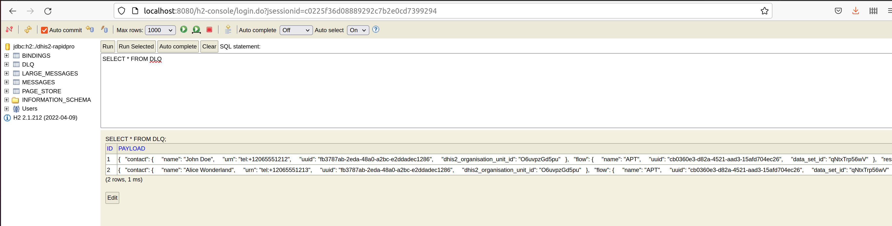

The H2 console is pre-configured to be available locally at [https://localhost:8443/management/h2-console](https://localhost:8443/management/h2-console). The console's relative URL path can be changed with the config property `spring.h2.console.path`. You will be greeted by the database's login page after logging into the monitoring & management system using the default login username and password `dhis2rapidpro`. Both the default database login username and password are `dhis2rapidpro`.

>***SECURITY***: immediately change the management and database credentials during setup (see `spring.security.user.name` and `spring.security.user.password` together with `spring.datasource.username` and `spring.datasource.password` in [Configuration](#configuration)).

For security reasons, the console only permits local access but this behaviour can be overridden by setting `spring.h2.console.settings.web-allow-others` to `true`. To completely disable access to the web console, set the parameter `spring.h2.console.enabled` to `false` though you still can connect to the data store with an SQL client.

The H2 DBMS is embedded with DHIS-to-RapidPro but the DBMS can be easily substituted with a more scalable JDBC-compliant DBMS such as PostgreSQL. You would need to change `spring.datasource.url` to a JDBC URL that references the new data store. Note: for a non-H2 data store, the data store vendor's JDBC driver needs to be added to the DHIS-to-RapidPro's Java classpath.

## Extending DHIS-to-RapidPro

In addition to being highly configurable, just about any piece of DHIS-to-RapidPro's functionality can be extended during configuration to suit your particular needs. A prerequisite to extending the behaviour is having knowledge of [Apache Camel](https://camel.apache.org/manual/faq/what-is-camel.html): the routing engine powering DHIS-to-RapidPro. In particular, you should be knowledgeable in Apache Camel's [YAML or XML DSL](https://camel.apache.org/manual/routes.html) in order to be able to define integration flows that override or complement the existing flows.

Integration flows in DHIS-to-RapidPro, known as [routes](https://camel.apache.org/manual/routes.html) in Apache Camel, are named according to their purpose. You can override any route if you know its name. The following is a list of the important routes that you may want to override:

| Route name             | Description                                                                            |
|------------------------|----------------------------------------------------------------------------------------|
| RapidPro Webhook       | Accepts and queues RapidPro webhook messages                                           |
| Consume Report         | De-queues the report for delivery to DHIS2                                             |
| Transform Report       | Maps and enriches the report as received by RapidPro prior to transmitting it to DHIS2 |
| Deliver Report         | Transmits the report the DHIS2                                                         |
| Retry Reports          | Re-queues reports marked for replay                                                    |
| Scan RapidPro Flows    | Polls RapidPro for flow runs and queues them                                           |
| Broadcast Reminders    | Queries DHIS2 for overdue reports and sends any reminders to RapidPro                  |
| Set up RapidPro        | Configures RapidPro for integration with DHIS2                                         |
| Create RapidPro Fields | Creates contact fields on RapidPro                                                     |
| Create RapidPro Group  | Creates contact group on RapidPro                                                      |
| Sync RapidPro Contacts | Synchronises RapidPro contacts with DHIS2 users                                        |

You should place the file or files containing the custom routes in a directory named `camel` within DHIS-to-RapidPro's current directory. The custom route will override the inbuilt route if the routes match by name. DHIS-to-RapidPro can reload the routes while its running therefore you have the option to extend the application at runtime. What follows is an example of a custom YAML route that overrides the inbuilt `Deliver Report` route:

```yaml
- route:
    id: "Deliver Report"
    from:
      uri: "direct:deliverReport"
      steps:
        - setProperty:
            name: msisdn
            jsonpath:
              headerName: originalPayload
              expression: "$.contact.urn"
        - setProperty:
            name: raw_msg
            jsonpath:
              headerName: originalPayload
              expression: "$.results.msg.value"
        - setProperty:
            name: report_type
            jsonpath:
              headerName: originalPayload
              expression: "$.flow.name"
        - toD:
            uri: "https://legacy.example/dhis2?authenticationPreemptive=true&authMethod=Basic&authUsername=alice&authPassword=secret&httpMethod=POST&msisdn=${exchangeProperty.msisdn}&raw_msg=${exchangeProperty.raw_msg}&facility=${header.orgUnitId}&report_type=${exchangeProperty.report_type}&aParam=${header.aParam}"
```

The above custom route overrides the original route such that aggregate reports are delivered to a non-DHIS2 system. It extracts a number of values from the report payload with the `setProperty` key and adds them to destination URL as HTTP query parameters. Consult the [Set Property](https://camel.apache.org/components/3.18.x/eips/setProperty-eip.html) and [JSONPath](https://camel.apache.org/components/3.18.x/languages/jsonpath-language.html) Apache Camel documentation for further information about setting properties and extracting values from within a route.

Besides adding query parameters, the route also configures the HTTP client for basic authentication using the reserved query parameters `authenticationPreemptive`, `authMethod`, `authUsername`, and `authPassword`. Consult the [HTTP component Apache Camel documentation](https://camel.apache.org/components/3.18.x/http-component.html) for further information about configuring the HTTP client.

## Troubleshooting Guide

Unexpected behaviour in DHIS-to-RapidPro typically manifests itself as:

* errors in the applications logs, or
* incorrect data (e.g., wrong organisation unit ID in the data value sets).

The first step to determine the root cause of unexpected behaviour is to search for recent errors in the [dead letter channel](#recovering-failed-reports):

```sql
-- SQL is compatible with H2
SELECT * FROM DEAD_LETTER_CHANNEL 
WHERE status = 'ERROR' AND created_at > DATEADD('DAY', -1, CURRENT_TIMESTAMP())	
```

The above SQL returns the reports that failed to be saved in DHIS2 within the last 24 hours. Zoom in the `ERROR_MESSAGE` column to read the technical error message that was given by the application. Should the error message describe an ephemeral failure like a network timeout, the rule of thumb is for the system operator to update the `STATUS` column to `RETRY` in order for DHIS-to-RapidPro to re-processes the failed reports:

```sql
-- SQL is compatible with H2
UPDATE DEAD_LETTER_CHANNEL 
SET status = 'RETRY' 
WHERE status = 'ERROR' AND created_at > DATEADD('DAY', -1, CURRENT_TIMESTAMP())	
```

After issuing the above SQL, DHIS-to-RapidPro will poll for the `RETRY` rows from the data store and re-process the reports. Processed rows, whether successful or not, are updated as `PROCESSED` and have their `LAST_PROCESSED_AT` column updated to the current time. If a retry fails, DHIS-to-RapidPro will go on to insert a corresponding new `ERROR` row in the `DEAD_LETTER_CHANNEL` table.

Non-transient failures such as validation errors require human intervention which might mean that you have to update the `payload` column value so that it conforms with the expected structure or data type:

```sql
UPDATE DEAD_LETTER_CHANNEL 
SET status = 'RETRY', payload = '{"contact":{"name":"John Doe","urn":"tel:+12065551213","uuid":"fb3787ab-2eda-48a0-a2bc-e2ddadec1286"},"flow":{"name":"APT","uuid":"cb0360e3-d82a-4521-aad3-15afd704ec26"},"results":{"msg":{"value":"APT.2.4.6"},"gen_ext_fund":{"value":"2"},"mal_pop_total":{"value":"10"},"mal_llin_distr_pw":{"value":"3"},"gen_domestic_fund":{"value":"5"}}}' 
WHERE id = '1023'
```

Deeper technical problems might not manifest themselves up as failed reports but as exceptions in the application logs. The logs can be analysed from the [Hawtio web console](#monitoring--management) or directly from the log file `dhis2rapidpro.log`, situated in DHIS-to-RapidPro's working directory. Keep an eye out for exceptions while combing through the logs. Any exception messages, including their stack traces, should be collected from the logs and further analysed. You may want to reach out to the [DHIS2 Community of Practice](https://community.dhis2.org/) for troubleshooting support. If all else fails, you can try increasing the log verbosity to zone in on the root cause. Setting the config property `logging.level.org.hisp.dhis.integration.rapidpro` to `DEBUG` will lead to the application printing more detail in the logs. As a last resort, though not recommended, you can have the application print even more detail by setting `logging.level.root` to `DEBUG`.

>CAUTION: be careful about increasing log verbosity since it may quickly eat up the server's disk space if the application is logging to a file, the default behaviour.


## Acknowledgments

This project is funded by UNICEF and developed by [HISP Centre](https://hisp.uio.no/) in collaboration with [HISP Uganda](https://www.hispuganda.org/) and [ITINORDIC](https://itinordic.com).
