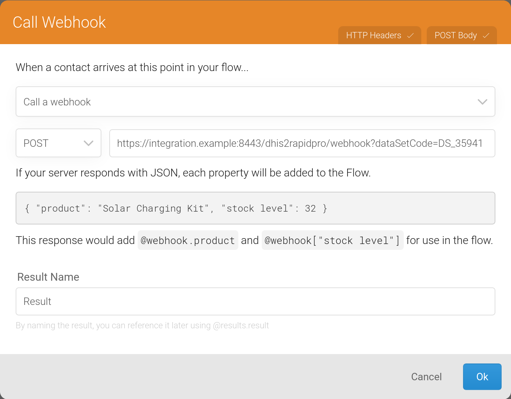
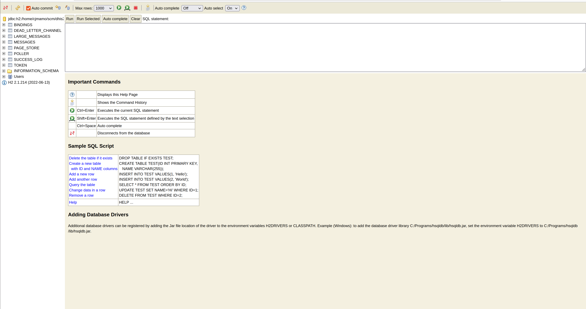

# DHIS2-to-RapidPro


## Table of Contents

1. [Introduction](#introduction)
2. [Requirements](#requirements)
3. [Setup](#setup)
4. [Getting Started](#getting-started)
5. [Configuration](#configuration)
6. [Monitoring & Management](#monitoring--management)
7. [Recovering Failed Reports](#recovering-failed-reports)
8. [Troubleshooting Guide](#troubleshooting-guide)

## Introduction

DHIS2-to-RapidPro is a stand-alone Java solution that integrates DHIS2 with RapidPro. [DHIS2](https://dhis2.org/about/) is an open-source information system primarily used in the health domain while [RapidPro](https://rapidpro.github.io/rapidpro/) is an open-source workflow engine for running mobile-based services. 

DHIS2-to-RapidPro provides:

* Routine synchronisation of RapidPro contacts with DHIS2 users
* A webhook consumer to receive aggregate reports from RapidPro and save them to DHIS2 as data value sets
* Automated reminders to RapidPro contacts for overdue aggregate reports

## Requirements

* Java 11
* RapidPro v7.2.4
* DHIS >= v2.36

## Setup

### DHIS2 Instructions

1. Set a code in each data element that will capture an aggregate value from RapidPro. To configure the data element code:
   1. Go to the Maintenance application
   2. Open the Data Elements page
   3. Search for the data element
   4. Enter a suitable code in the _Code_ field as shown next:
      
      >***IMPORTANT:*** you need to enter a code that starts with a letter, a hyphen, an underscore, or a whitespace to achieve successful interoperability between DHIS2 and RapidPro.

2. Create a [personal access token](https://docs.dhis2.org/en/use/user-guides/dhis-core-version-238/working-with-your-account/personal-access-tokens.html) or a user for DHIS2-to-RapidPro such that the application can authenticate on DHIS2 and has permissions to fetch all the DHIS2 users in addition to completing the applicable data sets for the relevant organisation units.
    >_Security note_: personal access token authentication is recommended over basic access authentication. 

### RapidPro Instructions

1. Save each incoming aggregate value in the RapidPro flow to a result like what is shown next:

The result name must match the code of the corresponding data element in DHIS2. Upper case letters in the data element code can be entered as lower case letters in the result name field while whitespaces and hyphens can be entered as underscores.

2. Create a webhook call node in the RapidPro flow to dispatch the results to DHIS2-to-RapidPro:
   
   The webhook call node must be configured as follows:
   - HTTP method selected is `POST`
   - URL field points to the DHIS2-to-RapidPro HTTPS address is listening on. The default HTTPS port number is _8443_ (see `server.port` in [Configuration](#configuration)): the path in the URL field is required to end with `/rapidProConnector/webhook`.
   - HTTP body has the `dhis2_organisation_unit_id` property in the `contact` object and the `data_set_id` property in the `flow object`. For example:
     ```
     @(json(object(
      "contact", object(
        "uuid", contact.uuid, 
        "name", contact.name, 
        "urn", contact.urn,
        "dhis2_organisation_unit_id", contact.dhis2_organisation_unit_id
      ),
      "flow", object(
        "uuid", run.flow.uuid, 
        "name", run.flow.name,
        "data_set_id", "qNtxTrp56wV"
      ),
      "results", foreach_value(results, extract_object, "value", "category")
     )))
     ```
     `data_set_id` identifies the DHIS2 data set that flow result values belong to. You need to look up the data set ID from the DHIS2 maintenance app and hard-code its ID as shown above.

3. If contact synchronisation is disabled (see `sync.rapidpro.contacts` in [Configuration](#configuration)), then create a custom contact field named _DHIS2 Organisation Unit ID_:
  
  You must populate this field, either manually or automatically, for each contact that will have its details sent to the DHIS2-to-RapidPro webhook. The field value should be the contact's DHIS2 organisation unit identifier. By default, DHIS2-to-RapidPro expects the organisation unit identifier to be the ID (see `org.unit.id.scheme` in [Configuration](#configuration)).

4. On the other hand, if contact synchronisation is enabled, then create a dedicated user for DHIS2-to-RapidPro with the _Editor_ role. Take note of the user's API token so that it can be used during DHIS2-to-RapidPro's configuration (see `rapidpro.api.token` in [Configuration](#configuration)).

## Getting Started

### *nix Usage Examples

##### RapidPro Contact Synchronisation Enabled
```shell
./dhis2-to-rapidpro.jar --dhis2.api.url=https://play.dhis2.org/2.37.2/api --dhis2.api.pat=d2pat_apheulkR1x7ac8vr9vcxrFkXlgeRiFc94200032556 --rapidpro.api.url=https://rapidpro.dhis2.org/api/v2 --rapidpro.api.token=3048a3b9a04c1948aa5a7fd06e7592ba5a17d3d0 --report.period.type=weekly
```

##### RapidPro Contact Synchronisation Disabled
```shell
./dhis2-to-rapidpro.jar --dhis2.api.url=https://play.dhis2.org/2.37.2/api --dhis2.api.pat=d2pat_apheulkR1x7ac8vr9vcxrFkXlgeRiFc94200032556 --report.period.type=weekly --sync.rapidpro.contacts=false
```

### Windows Usage Examples

##### RapidPro Contact Synchronisation Enabled
```shell
java -jar dhis2-to-rapidpro.jar --dhis2.api.url=https://play.dhis2.org/2.38.1/api --dhis2.api.pat=d2pat_apheulkR1x7ac8vr9vcxrFkXlgeRiFc94200032556 --rapidpro.api.url=https://rapidpro.dhis2.org/api/v2 --rapidpro.api.token=3048a3b9a04c1948aa5a7fd06e7592ba5a17d3d0 --report.period.type=weekly
```

##### RapidPro Contact Synchronisation Disabled
```shell
java -jar dhis2-to-rapidpro.jar --dhis2.api.url=https://play.dhis2.org/2.38.1/api --dhis2.api.pat=d2pat_apheulkR1x7ac8vr9vcxrFkXlgeRiFc94200032556 --report.period.type=weekly --sync.rapidpro.contacts=false
```

## Configuration

By order of precedence, a config property can be specified:

1. as a command-line argument (e.g., `--dhis2.api.url=https://play.dhis2.org/2.38.1/api`)
2. as an OS environment variable (e.g., `export DHIS2_API_URL=https://play.dhis2.org/2.38.1/api`)
3. in a key/value property file called `application.properties` or a YAML file named `application.yml`

| Config name                     |     | Description                                                                                                                                                                           | Default value                               | Example value                                      |
|---------------------------------|:----|---------------------------------------------------------------------------------------------------------------------------------------------------------------------------------------|---------------------------------------------|----------------------------------------------------|
| `dhis2.api.url`                 |     | DHIS2 server Web API URL.                                                                                                                                                             |                                             | `https://play.dhis2.org/2.38.1/api`                |
| `dhis2.api.pat`                 |     | Personal access token to authenticate with on DHIS2. This property is mutually exclusive to `dhis2.api.username` and `dhis2.api.password`.                                            |                                             | `d2pat_apheulkR1x7ac8vr9vcxrFkXlgeRiFc94200032556` |
| `dhis2.api.username`            |     | Username of the DHIS2 user to operate as.                                                                                                                                             |                                             | `admin`                                            |
| `dhis2.api.password`            |     | Password of the DHIS2 user to operate as.                                                                                                                                             |                                             |                                                    |
| `rapidpro.api.url`              |     | RapidPro server Web API URL. This property should be left empty if `sync.rapidpro.contacts` is `false`.                                                                               |                                             | `https://rapidpro.dhis2.org/api/v2`                |
| `rapidpro.api.token`            |     | API token to authenticate with on RapidPro. This property should be left empty if `sync.rapidpro.contacts` is `false`.                                                                |                                             | `3048a3b9a04c1948aa5a7fd06e7592ba5a17d3d0`         |
| `server.port`                   |     | The TCP port number the application will bind to for accepting HTTP requests.                                                                                                         | `8443`                                      | `443`                                              |
| `sync.schedule.expression`      |     | Cron expression for synchronising RapidPro contacts with DHIS2 users. By default, synchronisation occurs every half hour.                                                             | `0 0/30 * * * ?`                            | `0 0 0 * * ?`                                      |
| `reminder.schedule.expression`  |     | Cron expression for broadcasting reminders of overdue reports to RapidPro contacts. By default, overdue report reminders are sent at 9 a.m. every day.                                | `0 0 9 ? * *`                               | `0 0 0 * * ?`                                      |
| `sync.rapidpro.contacts`        |     | Whether to routinely create and update RapidPro contacts from DHIS2 users. Setting this property to `false` means that `rapidpro.api.url` and `rapidpro.api.token` can be left empty. | `true`                                      | `false`                                            |
| `reminder.data.set.ids`         |     | Comma-delimited list of DHIS2 data set IDs for which overdue report reminders are sent.                                                                                               |                                             | `qNtxTrp56wV,TuL8IOPzpHh`                          |
| `report.period.type`            |     | Period type to use for the data value set sent to DHIS2. Must be set to one of the following: `daily`, `weekly`, `monthly`, `bi_monthly`, `six_monthly`, `financial_year_nov`         |                                             | `weekly`                                           |
| `report.period.offset`          |     | Relative period to add or subtract from the current reporting period sent to DHIS2.                                                                                                   | `0`                                         | `-1`                                               |
| `org.unit.id.scheme`            |     | By which field organisation units are identified.                                                                                                                                     | `ID`                                        | `CODE`                                             |
| `spring.security.user.name`     |     | Login username for Hawtio and H2 web consoles.                                                                                                                                        | `dhis2rapidpro`                             | `admin`                                            |
| `spring.security.user.password` |     | Login password for Hawtio and H2 web consoles.                                                                                                                                        | `dhis2rapidpro`                             | `secret`                                           |
| `spring.h2.console.enabled`     |     | Whether to enable the H2 web console.                                                                                                                                                 | `true`                                      | `false`                                            |
| `spring.datasource.url`         |     | JDBC URL to access the dead letter channel. Changing this URL to connect to a non-H2 database requires that you add the database vendor's JDBC driver to the Java classpath.          | `jdbc:h2:./dhis2-rapidpro;AUTO_SERVER=TRUE` | `jdbc:postgresql://localhost:5432/dhis2rapidpro`   |
| `spring.jmx.enabled`            |     | Whether to expose the JMX metrics.                                                                                                                                                    | `true`                                      | `false`                                            |


##  Monitoring & Management

DHIS2-to-RapidPro exposes its metrics through JMX. A JMX client like [VisualVM](https://visualvm.github.io/) can be used to observe these metrics, however, DHIS2-to-RapidPro comes bundled with [Hawtio](https://hawt.io/) so that the system operator can easily monitor and manage runtime operations of the application without prior setup

From the Hawtio web console, apart from browsing application logs, the system operator can manage queues and endpoints, observe the application health status and queued RapidPro webhook messages, collect CPU and memory diagnostics, as well as view application settings:


You can log into the Hawtio console locally from [https://localhost:8443/management/hawtio](https://localhost:8443/management/hawtio) using the username and password `dhis2rapidpro`. You can set the parameter `management.endpoints.web.exposure.include` (i.e., `--management.endpoints.web.exposure.include=`) to an empty value to deny HTTP access to the Hawtio web console. 

>***IMPORTANT***: immediately change the login credentials during setup (see `spring.security.user.name` and `spring.security.user.password` in [Configuration](#configuration)).

## Recovering Failed Reports

A report that fails to be uploaded to DHIS2, perhaps because of an invalid webhook payload or an HTTP timeout error, has its associated RapidPro webhook JSON payload pushed to a relational dead letter channel for manual inspection. The dead letter channel table schema is as follows:

| Column name       | Column type              | Description                                                                                                                                                                                                                                                                                                                           | Column value example                                                                                                                                                                                                                                                                                                                                                                                                        |
|-------------------|--------------------------|---------------------------------------------------------------------------------------------------------------------------------------------------------------------------------------------------------------------------------------------------------------------------------------------------------------------------------------|-----------------------------------------------------------------------------------------------------------------------------------------------------------------------------------------------------------------------------------------------------------------------------------------------------------------------------------------------------------------------------------------------------------------------------|
| ID                | INTEGER                  | An auto-increment number identifying the row uniquely.                                                                                                                                                                                                                                                                                | 6                                                                                                                                                                                                                                                                                                                                                                                                                           |
| PAYLOAD           | VARCHAR                  | Webhook JSON message as sent by RapidPro.                                                                                                                                                                                                                                                                                             | `{"contact":{"name":"John Doe","urn":"tel:+12065551213","uuid":"fb3787ab-2eda-48a0-a2bc-e2ddadec1286","dhis2_organisation_unit_id":"O6uvpzGd5pu"},"flow":{"name":"APT","uuid":"cb0360e3-d82a-4521-aad3-15afd704ec26","data_set_id":"qNtxTrp56wV"},"results":{"msg":{"value":"APT.2.4.6"},"gen_ext_fund":{"value":"2"},"mal_pop_total":{"value":"10"},"mal_llin_distr_pw":{"value":"3"},"gen_domestic_fund":{"value":"5"}}}` |
| ERROR_MESSAGE     | VARCHAR                  | Message describing the root cause of the error.                                                                                                                                                                                                                                                                                       | `Response{protocol=http/1.1, code=500, message=, url=https://play.dhis2.org/2.38.1/api//dataValueSets?dataElementIdScheme=CODE&orgUnitIdScheme=bar}`                                                                                                                                                                                                                                                                        |
| STATUS            | ENUM                     | Specifies the row's state which determines how the application processes the row. The user sets the status to `RETRY` for payloads that need to be retried. DHIS2-to-RapidPro sets the status to `ERROR` for payloads that could not be processed successfully. Alternatively, payloads that are processed are marked as `PROCESSED`. | `ERROR`                                                                                                                                                                                                                                                                                                                                                                                                                     |
| CREATED_AT        | TIMESTAMP WITH TIME ZONE | Denotes the time the row was created.                                                                                                                                                                                                                                                                                                 | `2022-07-20 11:09:57.992 +0200`                                                                                                                                                                                                                                                                                                                                                                                             |
| LAST_PROCESSED_AT | TIMESTAMP WITH TIME ZONE | Denotes the last time the row was processed.                                                                                                                                                                                                                                                                                          | `2022-07-20 11:09:57.992 +0200`                                                                                                                                                                                                                                                                                                                                                                                             |

You can re-process a failed report by setting its corresponding row status column to `RETRY` using an [ANSI SQL UPDATE](https://www.w3schools.com/sql/sql_update.asp) command issued from an SQL client connected to the data store. For instance:

```sql
UPDATE DEAD_LETTER_CHANNEL SET status = 'RETRY' WHERE STATUS = 'ERROR' 
```

[H2](https://www.h2database.com) is the default relational data store that manages the dead letter channel. H2 has an in-built web console which allows you to issue SQL commands in order to view, edit, and retry failed reports:



The H2 console is pre-configured to be available locally at [https://localhost:8443/management/h2-console](https://localhost:8443/management/h2-console). The default username and password are both `dhis2rapidpro`. The console's relative URL path can be changed with the config property `spring.h2.console.path`.

>***IMPORTANT***: immediately change the credentials during setup (see `spring.security.user.name` and `spring.security.user.password` in [Configuration](#configuration)).

For security reasons, the console only permits local access but this behaviour can be overridden by setting `spring.h2.console.settings.web-allow-others` to `true`. To completely disable access to the web console, set the parameter `spring.h2.console.enabled` to `false` though you still can connect to the data store with an SQL client.

The H2 DBMS is embedded with DHIS2-to-RapidPro but the DBMS can be easily substituted with a more scalable JDBC-compliant DBMS such as PostgreSQL. You would need to change `spring.datasource.url` to a JDBC URL that references the new data store. Note: for a non-H2 data store, the data store vendor's JDBC driver needs to be added to the DHIS2-to-RapidPro's Java classpath.

## Troubleshooting Guide

Unexpected behaviour in DHIS2-to-RapidPro typically manifests itself as:

* errors in the applications logs, or 
* incorrect data (e.g., wrong organisation unit ID in the data value sets). 

The first step to determine the root cause of unexpected behaviour is to search for recent errors in the [dead letter channel](#recovering-failed-reports):

```sql
-- SQL is compatible with H2
SELECT * FROM DEAD_LETTER_CHANNEL 
WHERE status = 'ERROR' AND created_at > DATEADD('DAY', -1, CURRENT_TIMESTAMP())	
```

The above SQL returns the reports that failed to be saved in DHIS2 within the last 24 hours. Zoom in the `ERROR_MESSAGE` column to read the technical error message that was given by the application. Should the error message describe a transient failure like a network timeout, the rule of thumb is for the system operator to update the `STATUS` column to `RETRY` in order for DHIS2-to-RapidPro to re-processes the failed reports:

```sql
-- SQL is compatible with H2
UPDATE DEAD_LETTER_CHANNEL 
SET status = 'RETRY' 
WHERE status = 'ERROR' AND created_at > DATEADD('DAY', -1, CURRENT_TIMESTAMP())	
```

After issuing the above SQL, DHIS2-to-RapidPro will poll for the `RETRY` rows from the data store and re-process the reports. Processed rows, whether successful or not, are updated as `PROCESSED` and have their `LAST_PROCESSED_AT` column updated to the current time. If a retry fails, DHIS2-to-RapidPro will go on to insert a corresponding new `ERROR` row in the `DEAD_LETTER_CHANNEL` table. 

Non-transient failures such as validation errors require human intervention which might mean that you have to update the `payload` column value so that it conforms with the expected structure or data type:

```sql
UPDATE DEAD_LETTER_CHANNEL 
SET status = 'RETRY', payload = '{"contact":{"name":"John Doe","urn":"tel:+12065551213","uuid":"fb3787ab-2eda-48a0-a2bc-e2ddadec1286","dhis2_organisation_unit_id":"O6uvpzGd5pu"},"flow":{"name":"APT","uuid":"cb0360e3-d82a-4521-aad3-15afd704ec26","data_set_id":"qNtxTrp56wV"},"results":{"msg":{"value":"APT.2.4.6"},"gen_ext_fund":{"value":"2"},"mal_pop_total":{"value":"10"},"mal_llin_distr_pw":{"value":"3"},"gen_domestic_fund":{"value":"5"}}}' 
WHERE id = '1023'
```

Deeper technical problems might not manifest themselves up as failed reports but as exceptions in the application logs. The logs can be analysed from the [Hawtio web console](#monitoring--management) or directly from the log file `dhis-to-rapidpro.log`, situated in DHIS2-to-RapidPro's working directory. Keep an eye out for exceptions while combing through the logs. Any exception messages, including their stack traces, should be collected from the logs and further analysed. You may want to reach out to the [DHIS2 Community of Practice](https://community.dhis2.org/) for troubleshooting support. If all else fails, you can try increasing the log verbosity to zone in on the root cause. Setting the config property `logging.level.org.hisp.dhis.integration.rapidpro` to `DEBUG` will lead to the application printing more detail in the logs. As a last resort, though not recommended, you can have the application print even more detail by setting `logging.level.root` to `DEBUG`. 

>***CAUTION:*** be careful about increasing log verbosity since it may quickly eat up the server's disk space if the application is logging to a file, the default behaviour.