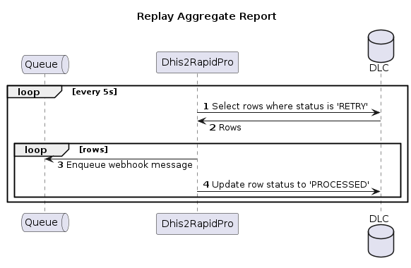

# Table of Contents

1. [Use Case Diagram](#use-case-diagram)
2. [Sequence Diagrams](#sequence-diagrams)
3. [Deployment Diagram](#deployment-diagram)
4. [DHIS2 API JSON Schemas](#json-schemas)

## Use Case Diagram


## Sequence Diagrams




## Deployment Diagram


## JSON Schemas

### dataElements.json

```json
{
  "$schema": "http://json-schema.org/draft-04/schema#",
  "type": "object",
  "properties": {
    "pager": {
      "type": "object",
      "properties": {
        "page": {
          "type": "integer"
        },
        "pageCount": {
          "type": "integer"
        },
        "total": {
          "type": "integer"
        },
        "pageSize": {
          "type": "integer"
        },
        "nextPage": {
          "type": "string"
        }
      }
    },
    "dataElements": {
      "type": "array",
      "items": {
        "type": "object",
        "properties": {
          "code": {
            "type": "string"
          }
        }
      }
    }
  }
}
```

### dataSets.json

```json
{
  "$schema": "http://json-schema.org/draft-04/schema#",
  "type": "object",
  "properties": {
    "pager": {
      "type": "object",
      "properties": {
        "page": {
          "type": "integer"
        },
        "pageCount": {
          "type": "integer"
        },
        "total": {
          "type": "integer"
        },
        "pageSize": {
          "type": "integer"
        },
        "nextPage": {
          "type": "string"
        }
      }
    },
    "dataSets": {
      "type": "array",
      "items": {
        "type": "object",
        "properties": {
          "id": {
            "type": "string"
          },
          "name": {
            "type": "string"
          },
          "organisationUnits": {
            "type": "object",
            "properties": {
              "id": {
                "type": "string"
              }
            }
          },
          "periodType": {
            "type": "string"
          }
        }
      }
    }
  }
}
```

### dataValueSet.json

```json
{
  "$schema": "https://json-schema.org/draft/2020-12/schema",
  "type": "object",
  "properties": {
    "completeDate": {
      "type": "string"
    },
    "dataSet": {
      "type": "string"
    },
    "dataValues": {
      "type": "array",
      "items": {
        "type": "object",
        "properties": {
          "categoryOptionCombo": {
            "type": "string"
          },
          "dataElement": {
            "type": "string"
          },
          "value": {
            "type": "string"
          },
          "comment": {
            "type": "string"
          }
        }
      }
    },
    "orgUnit": {
      "type": "string"
    },
    "period": {
      "type": "string"
    }
  }
}
```

### users.json

```json
{
  "$schema": "https://json-schema.org/draft/2020-12/schema",
  "type": "object",
  "properties": {
    "users": {
      "type": "array",
      "items": {
        "type": "object",
        "properties": {
          "firstName": {
            "type": "string"
          },
          "id": {
            "type": "string"
          },
          "organisationUnits": {
            "type": "object",
            "properties": {
              "id": {
                "type": "string"
              }
            }
          },
          "phoneNumber": {
            "type": "string"
          },
          "surname": {
            "type": "string"
          }
        }
      }
    }
  }
}
```

### listGrid.json

```json
{
  "$schema": "https://json-schema.org/draft/2020-12/schema",
  "type": "object",
  "properties": {
    "headerWidth": {
      "type": "integer"
    },
    "headers": {
      "type": "array",
      "items": {
        "type": "object",
        "properties": {
          "column": {
            "type": "integer"
          },
          "hidden": {
            "type": "boolean"
          },
          "meta": {
            "type": "booleam"
          },
          "name": {
            "type": "string"
          },
          "type": {
            "type": "string"
          },
          "valueType": {
            "type": "string",
            "enum": [
              "TEXT",
              "LONG_TEXT",
              "LETTER",
              "PHONE_NUMBER",
              "EMAIL",
              "BOOLEAN",
              "TRUE_ONLY",
              "DATE",
              "DATETIME",
              "TIME",
              "NUMBER",
              "UNIT_INTERVAL",
              "PERCENTAGE",
              "INTEGER",
              "INTEGER_POSITIVE",
              "INTEGER_NEGATIVE",
              "INTEGER_ZERO_OR_POSITIVE",
              "TRACKER_ASSOCIATE",
              "USERNAME",
              "COORDINATE",
              "ORGANISATION_UNIT",
              "REFERENCE",
              "AGE",
              "URL",
              "FILE_RESOURCE",
              "IMAGE",
              "GEOJSON"
            ]
          }
        }
      }
    },
    "height": {
      "type": "integer"
    },
    "metaData": {
      "type": "object",
      "properties": {
        "items": {
          "type": "object"
        },
        "dimensions": {
          "type": "object"
        }
      }
    },
    "rows": {
      "type": "array",
      "items": {
        "type": "array",
        "items": {
          "type": "string"
        }
      }
    },
    "title": {
      "type": "string"
    },
    "width": {
      "type": "integer"
    }
  }
}
```