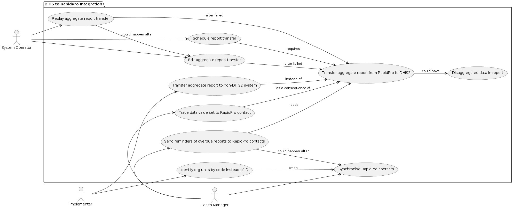
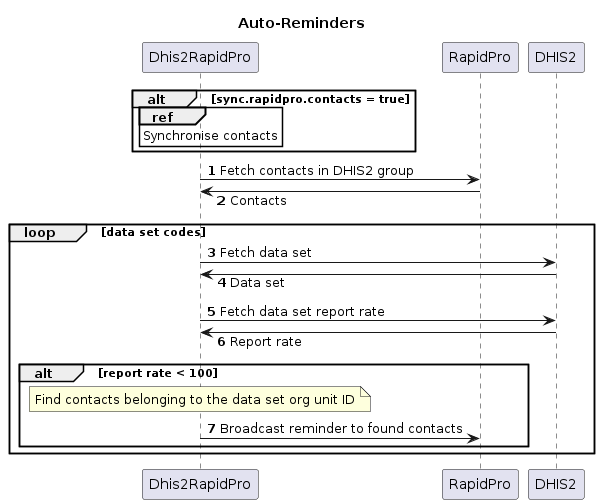

# Table of Contents

1. [Use Case Diagram](#use-case-diagram)
2. [Sequence Diagrams](#sequence-diagrams)
3. [Deployment Diagram](#deployment-diagram)

## Use Case Diagram

## Sequence Diagrams

## Deployment Diagram

